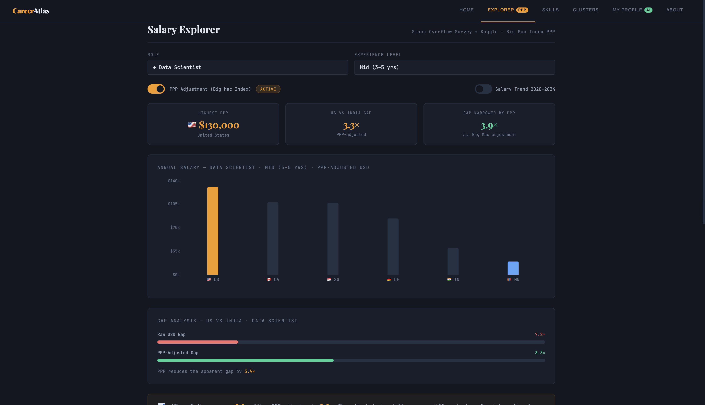
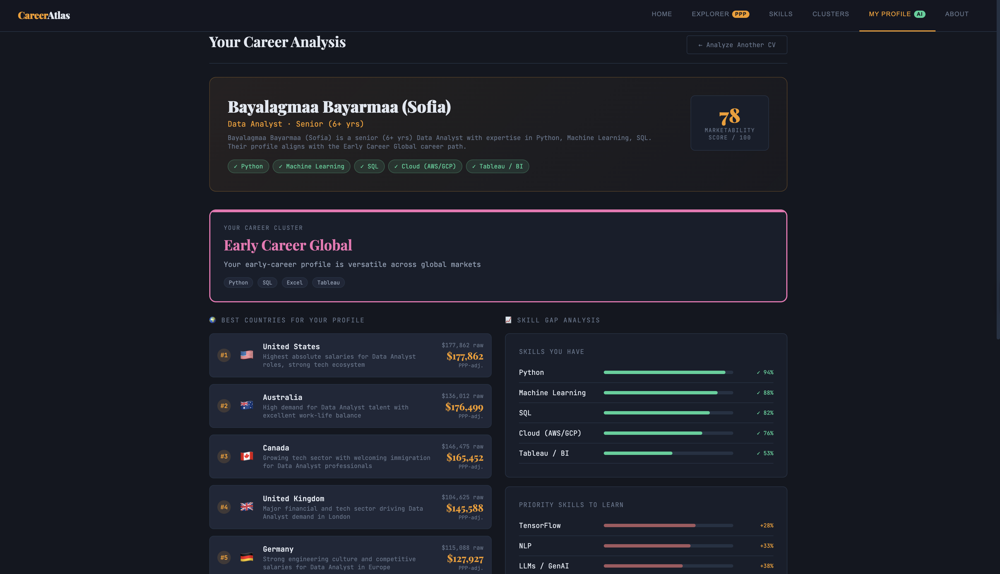

# CareerAtlas
### Global Data Science Career Path Analyzer
**AUM Capstone Project · Spring 2025**

---

## Description

CareerAtlas is a data science career tool that compares salaries across 15 countries using PPP (Purchasing Power Parity) adjustment via the Big Mac Index — because raw USD numbers are misleading for international students. Upload your CV and a local ML pipeline (RandomForest + KMeans + TF-IDF) extracts your skills, infers your role, predicts your career cluster, and recommends the best countries for your profile with PPP-adjusted salary estimates.

---

## Live Demo

**[https://career-atlas-sbzu.vercel.app](https://career-atlas-sbzu.vercel.app)**

| Service | URL |
|---|---|
| Frontend (Vercel) | https://career-atlas-sbzu.vercel.app |
| ML Backend (Render) | https://careeratlas.onrender.com |

---

## Screenshots

**Salary Explorer — PPP-adjusted salaries across 15 countries**


**CV Analyzer — ML-powered career analysis with country recommendations**


---

## Features

- **Salary Explorer** — Compare data science salaries across 15 countries, PPP-adjusted via the Big Mac Index
- **Skills in Demand** — NLP-extracted skill rankings from 376K+ Stack Overflow survey responses
- **Career Clusters** — K-Means archetypes (Research Track, Industry Applied, Emerging Markets, Early Career Global) with a 3-question quiz
- **CV Analyzer** — Upload a PDF or paste CV text; local ML models extract skills, infer your role, and recommend the best-fit countries with PPP-adjusted salary estimates

---

## Technology Stack

**Frontend**
- React + Vite
- Recharts (bar, scatter, radar, line charts)
- Deployed on Vercel

**Backend (ML API)**
- Python · FastAPI · uvicorn
- scikit-learn: RandomForestRegressor (salary), KMeans (career clusters), TF-IDF + LogisticRegression (role classification)
- pdfplumber (PDF text extraction)
- joblib (model serialization)
- Deployed on Render (free tier)

---

## Data Sources

- [Stack Overflow Developer Survey 2020–2024](https://survey.stackoverflow.co/)
- [Kaggle DS/ML Salary Dataset](https://www.kaggle.com/datasets/henryshan/2023-data-scientists-salary)
- [The Economist Big Mac Index](https://www.economist.com/big-mac-index)
- [World Bank PPP Indicators](https://data.worldbank.org/indicator/PA.NUS.PPP)

---

## Setup / Running Locally

### Prerequisites
- Node.js 18+
- Python 3.9+

### 1. Clone the repo
```bash
git clone https://github.com/bbayalagmaa/careerAtlas.git
cd careerAtlas
```

### 2. Start the ML backend
```bash
cd backend
pip install -r requirements.txt
python train_models.py        # trains models, saves to backend/models/
uvicorn server:app --reload --port 8000
# → http://localhost:8000
```

### 3. Start the frontend
```bash
cd ..                         # back to project root
cp .env.example .env          # uses localhost:8000 by default
npm install
npm run dev
# → http://localhost:5173/careerAtlas/
```

### Environment variables
| Variable | Description | Default |
|---|---|---|
| `VITE_API_URL` | URL of the ML backend | `http://localhost:8000` |

---

## Known Issues

- PDF CV analysis works best with text-based PDFs; scanned image PDFs are not supported
- Salary data is based on 2020–2024 survey data and may not reflect rapid market changes
- Mongolia Big Mac price is estimated (no McDonald's), introducing additional PPP uncertainty
- Backend on Render free tier may have a ~30s cold start after inactivity

---

## Future Improvements

- Add more countries and update salary data annually
- Integrate live job posting data (LinkedIn API, Indeed)
- Add a comparison mode to put two CV profiles side-by-side
- Support more languages in the CV analyzer

---

## Author

Bayalagmaa · AUM · Data Science Capstone · Spring 2025  
GitHub: [bbayalagmaa](https://github.com/bbayalagmaa)
